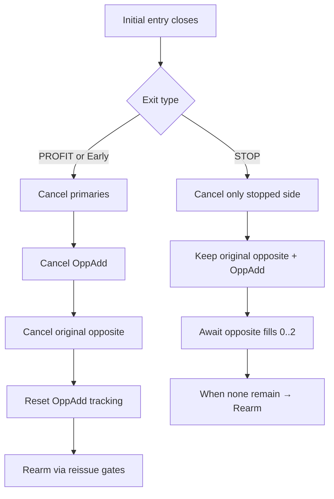
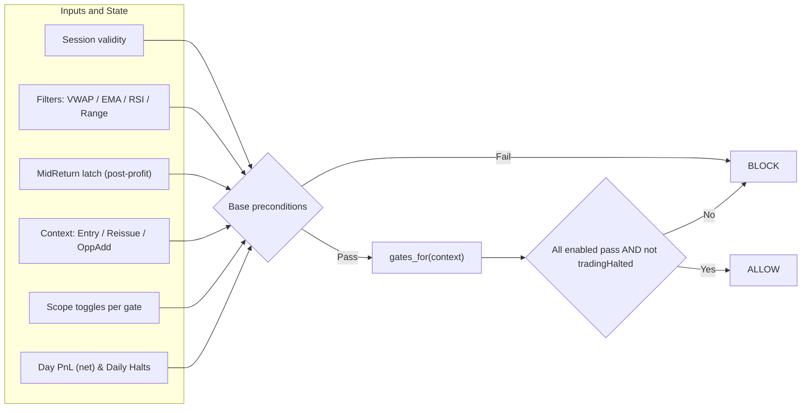

# DBO_Prod (Range Breakout + Recoup Add) — Business Rules, Stateflows, Feature Inventory

This repo contains the **current TradingView strategy** used for the DBO bot (“DBO_Prod”). This README prioritizes:

- **Business rules** (what the system does and why)
- **Stateflows** (how it behaves across fills/exits)
- **Feature inventory** (so you can build a migration roadmap to a new platform)

---

## What the bot does (1‑minute mental model)

1. **Build a range** over a fixed lookback window ending at a configurable “range end” time.
2. Once the range is formed and quality filters pass, **place both breakout brackets**:
   - Long stop above the range
   - Short stop below the range
3. When one side fills, optionally place a **Recoup (Opposite Add)** in the *opposite direction* (often routed to **YM** as a proxy).
4. Manage the day with **news blocks**, **daily P/L halts**, a **trade-limit**, and strict **end-of-session cleanup**.
5. If the Recoup hits its TP, the bot performs a **paired exit** to close the micro leg too.

---

## Key concepts / glossary

- **Range window:** the period used to measure `dayHigh/dayLow` (the “box”).
- **Breakout window:** the period after the range ends where trading is allowed (until `exitTime`).
- **Bracket set:** a pair of pending orders (Long + Short) with attached TP/SL.
- **Cycle:** a full sequence from “brackets armed” → (fill) → (profit/stop) → (rearm or stand-down).
- **Recoup / Opposite Add:** an additional opposite-direction trade intended to recover loss / stabilize outcomes.
- **Proxy ticker:** when enabled, Recoup orders/exits are emitted as alerts for a different symbol (typically **YM**).

---

## Time & session rules

### Time zones
- **`tzInput`**: primary session time zone (defaults to `America/Los_Angeles`).
- **`newsTzInput`**: interpretation time zone for *news HHMM* times (defaults to Pacific).

### Session construction (single daily session)
Inputs:
- **Range End**: `rangeEndHour`, `rangeEndMin`
- **Lookback**: `lookbackH`, `lookbackM`
- **Exit Duration**: `exitDurH`, `exitDurM`
- **Early Exit Minutes**: `earlyExitMinutes`

Business rule:
- `rangeEnd` is today’s “Range End” timestamp in `tzInput` (DST-safe).
- `rangeStart = rangeEnd − lookbackDuration`.
- `exitTime = rangeEnd + exitDuration`.
- **Early-exit window opens at** `earlyExitTime = exitTime − earlyExitMinutes`.

### Daily boundary for P/L halts
- The “trading day” for halt math resets at **15:00 (3:00pm) in `tzInput`**.
- If the current bar is earlier than today’s 15:00, the day-start rolls back to yesterday’s 15:00.

---

## Range formation & levels

During the **range window**:
- Track `dayHigh` = highest high; `dayLow` = lowest low.

After the range ends:
- Compute breakout levels from offsets:
  - `longEntry  = dayHigh + entryOff`
  - `shortEntry = dayLow  − entryOff`
  - `longStop   = dayLow  − stopOff`
  - `shortStop  = dayHigh + stopOff`
- Range width and TP:
  - `rangeSize = |longEntry − longStop|`
  - `tpSize = rangeSize × tpRatio`
  - `longTP  = longEntry  + tpSize`
  - `shortTP = shortEntry − tpSize`

Stop-loss type:
- `slType = RR` → stop size derived from TP (`rrRatio`)
- `slType = Points` → fixed `ptsSL`

---

## Quality filters (when we do **not** trade)

The bot can invalidate the session (for the whole breakout window) based on:

1. **Min/Max range width**
   - `minRangePoints` (disable with -1)
   - `maxRangePoints` (disable with -1)

2. **Midpoint start proximity (deferred start)**
   - `midpointStartTolerancePct > 0` means: **do not start** unless price returns near midpoint during the breakout window.
   - A “deferred start” is visualized as a red box that extends until the official start is latched.

3. **News-based blocking** (see next section)

Snapshot rule (important):
- On the first *eligible* breakout moment, the bot freezes a “sessionValid” decision so it doesn’t oscillate later during the day (the system treats “this is a tradable day” as a yes/no latch).

---

## News blocking & intraday delay policy

News events are stored internally as `(date, HHMM, TypeId)` rows.

### Severity toggles
- The bot supports three severities (1/2/3) with enable toggles:
  - `useSev3Filter`, `useSev2Filter`, `useSev1Filter`

### Per-type policy
For each TypeId, a dropdown selects one policy:
- **Inherit**: blocks only if that severity’s toggle is enabled.
- **Ignore**: never blocks.
- **Delay then trade**: blocks until event time + configured delay minutes.
- **Block entire day**: blocks the full day.

### Intraday Delay Mode (all severities)
- `useSev3TimeWindow = true` enables **Intraday Delay Mode**.
- In this mode, the bot:
  - Blocks the day **only** if there is at least one “Block entire day” event **or**
  - Blocks **until** the latest “timed” event today plus the configured post-delay minutes.

Important detail:
- Timed events require a valid HHMM (> 0). Rows with `HHMM = 0000` only matter if their policy is **Block entire day**.

### How this affects trading
- When news is blocking:
  - New bracket placements are prevented.
  - “Halt / Block” state is shown in telemetry.
- When the last timed event + delay passes, trading can resume **within the same session** (if other gates allow).

---

## Risk management & trade limits

### Base sizing
- `riskDollars` is the **target $ risk** for the initial micro trade sizing.

### Daily risk halts (P/L caps)
- `maxDailyLoss` (caps new risk; also used to cap Recoup additions)
- `maxDailyProfit` (halts new trading once reached)

PnL computation:
- Uses **closed trades only**, summed since the 15:00 day boundary:
  - `points = (exit − entry)` (sign-aware for long/short)
  - `dollars = points × syminfo.pointvalue × |qty|`
  - `net = dollars − strategy.closedtrades.commission(i)`

### Trade limit
- `tradeLimit` counts **sets** (Long+Short bracket placements), not individual fills.
- The bot will not arm a new set once `lastIssuedTradeNumber >= tradeLimit`.

### Price gate before re-arming
After the first bracket set has been issued:
- The bot requires price to return **inside the range** before it will place the next set.

---

## Bracket cycle & stateflows (flow charts)

These charts are included because they remain a good, implementation-agnostic representation of “what should happen.”

### High-level state machine

```mermaid
stateDiagram-v2
    direction LR

    [*] --> IDLE

    IDLE --> ARMED: Session valid
Place bracket set (Long + Short)

    ARMED --> LONG_LIVE: Long fills
    ARMED --> SHORT_LIVE: Short fills
    ARMED --> IDLE: Block/Halt/EOS
Cancel inventory

    LONG_LIVE --> LONG_PROFIT: Long TP
    LONG_LIVE --> LONG_STOP: Long SL
    LONG_LIVE --> LONG_EARLY_EXIT: Early Exit (profit-only)
    LONG_LIVE --> EOS: End of Session

    SHORT_LIVE --> SHORT_PROFIT: Short TP
    SHORT_LIVE --> SHORT_STOP: Short SL
    SHORT_LIVE --> SHORT_EARLY_EXIT: Early Exit (profit-only)
    SHORT_LIVE --> EOS: End of Session

    LONG_PROFIT --> CLEANUP_PROFIT: Cancel opposite + Recoup
Reset cycle
    SHORT_PROFIT --> CLEANUP_PROFIT: Cancel opposite + Recoup
Reset cycle

    LONG_STOP --> WAIT_OPP: Keep opposite inventory
(Short bracket + optional Recoup)
    SHORT_STOP --> WAIT_OPP: Keep opposite inventory
(Long bracket + optional Recoup)

    WAIT_OPP --> LONG_LIVE: Opposite long fills
    WAIT_OPP --> SHORT_LIVE: Opposite short fills
    WAIT_OPP --> REARM: Inventory cleared
Re-arm permitted

    LONG_EARLY_EXIT --> CLEANUP_EXIT: Cancel + flatten
Stand down
    SHORT_EARLY_EXIT --> CLEANUP_EXIT: Cancel + flatten
Stand down

    EOS --> CLEANUP_EXIT: Cancel + flatten
Stand down

    CLEANUP_PROFIT --> REARM: Rearm allowed
    REARM --> ARMED: If rearm gates pass
    CLEANUP_EXIT --> IDLE

```

### PROFIT vs STOP cleanup — decision tree



### Modular gate manager — concept



**Exit invariants (apply everywhere):**
- **Order of operations:** cancel → close → emit alerts.
- “Emergency sweep” behavior may re-emit exit/cancel logic on a later bar to reduce webhook/broker desync risk.

---

## Recoup (Opposite Add) & YM proxy routing

### Trigger
- When a micro position opens (Long or Short), the bot evaluates a Recoup add in the **opposite direction**.

### Entry/TP logic
- Recoup entry is offset by `oppositeReissueEntryOffsetPts`.
  - If this input is **-1**, the bot uses the legacy match offset (entryOff − stopOff).
- Recoup TP can be overridden with `oppositeTpOverride` (if set ≥ 0).

### Stop distance scaling (Recoup only)
- `oppAddStopPct` scales the Recoup stop distance vs the original bracket distance (percent).

### Sizing (risk-delta targeting)
- The bot targets a Recoup that increases total risk toward:
  - `baseRisk × oppositeQtyMultiplier`
- It computes the **additional** quantity needed (“risk delta”) rather than mirroring the micro size.

### Proxy routing (YM)
If proxy routing is enabled (typical setup):
- Recoup orders are emitted as proxy alerts for the YM ticker (derived from the chart symbol).
- Quantity conversion uses `proxyQtyMul` (default ~0.10, i.e., YM ≈ 10× MYM).

Backtesting behavior:
- In historical bars, the strategy simulates Recoup logic on the chart symbol so the Strategy Tester can model the logic.

### Paired exit on Recoup TP
If the Recoup TP level is touched:
- The bot issues a **paired exit** to close the MYM leg as well, to lock the combined outcome.

---

## Exits & safety behavior

The strategy has multiple exit “doors,” but the intent is consistent:

1. **ProfitTP cleanup** — cancel opposite inventory and reset cycle; may re-arm.
2. **Early Exit** — near session end: if the current position is profitable (close vs avg), exit early.
3. **End of Session (EOS)** — at or after `exitTime`: cancel orders, flatten positions, and sweep proxy exits.
4. **Emergency exit (scheduled)** — often triggered one bar after profit to re-emit exit/cancel logic and reduce desync risk.

---

## Visuals & telemetry

Key visuals you’ll see on-chart:
- **Range box** during formation.
- **Deferred-start red box** if midpoint gating delays the official start.
- **Active (yellow) box** during the trading window.

Common telemetry fields (table / data-window):
- Trading status (Trading vs Blocked) + reason
- Next block / resume time (intraday delay mode)
- Day P/L and halt reason
- Trade count / trade-limit state

---

## Feature inventory (for migration roadmap)

### Session & time handling
- [x] DST-safe time anchors
- [x] Range window built from RangeEnd + Lookback duration
- [x] Breakout window built from RangeEnd + ExitDuration
- [x] Daily reset boundary at 15:00 local

### Core trading engine
- [x] Dual bracket placement (Long + Short)
- [x] Trade-limit by “sets”
- [x] Price-inside-range gate before re-arming
- [x] Midpoint deferred-start gate
- [x] Min/Max range width filters
- [x] Cooldowns / per-bar de-dupe latches

### Recoup / Opposite Add
- [x] Opposite-direction add on entry (optional)
- [x] Risk-delta sizing to a multiplier target
- [x] Stop distance scaling (% of original)
- [x] Opposite TP override
- [x] Paired exit when Recoup TP is hit

### News & blocking
- [x] Embedded news rows (date, HHMM, TypeId)
- [x] Severity toggles (1/2/3)
- [x] Per-type policy dropdown (Inherit / Ignore / Delay / All-day)
- [x] Intraday Delay Mode + post-event delay minutes
- [x] “All-day” hard blocks

### Risk & halts
- [x] Daily loss cap (halts new trading)
- [x] Daily profit cap (halts new trading)
- [x] P/L computed from closed trades since 15:00 boundary

### Safety exits & cleanup
- [x] Early exit window (profit-only exit)
- [x] EOS cancel/flatten
- [x] Scheduled emergency re-sweep for desync reduction
- [x] Proxy cancel-sweep / proxy exit support

### Integrations
- [x] TradersPostDeluxe alert/JSON integration (proxy orders + proxy exits)

---

## Suggested roadmap for the “new platform” port

1. **Session engine module**
   - Time-zone anchors, DST-safe window creation, day-boundary.
2. **Range builder**
   - Rolling extrema, range validation, midpoint measurement.
3. **Order engine (state machine)**
   - Bracket sets, trade-limit sets, cooldowns, price-inside-range gate.
4. **News calendar service**
   - Data ingestion (CSV/API), policy resolution, intraday delay math, “resume at” timestamps.
5. **Risk service**
   - Daily P/L aggregation, caps, projected-risk gate for new orders.
6. **Recoup/Proxy module**
   - Risk-delta sizing, proxy mapping (MYM↔YM), paired exits.
7. **Execution & reliability**
   - Idempotent exit/cancel sweeps, webhook retry policy, audit log.
8. **Telemetry/UI**
   - Single coherent “Status + Why” model shared by UI, logs, and gates.

---

## Repo notes

- Script: **DBO_Prod** (TradingView Pine).
- External dependency: TradingView library **`adam_overton/TradersPostDeluxe`** for advanced order JSON/alerts.

---

## Disclaimer

This strategy is provided “as-is” for research/automation. Futures trading is risky; use strict risk controls and validate behavior in a paper environment before live deployment.
