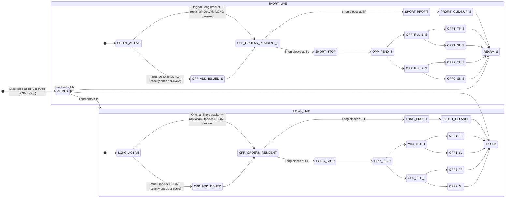

# Bracket Cycle & Opposite-Add — Spec & Stateflows (README)

This README documents the agreed behavior for bracket cycles, single-shot Opposite-Add issuance, and cleanup rules on **PROFIT** vs **STOP**, plus the **modular gate manager** and its per-context overrides. All diagrams are **Mermaid** and render on GitHub.

---

## TL;DR (Behavior Contract)

- **Initial bracket placement (ARMED):** Both Long and Short brackets are placed.
- **On initial fill (Long or Short):**
  - Keep the **original opposite bracket** in place.
  - Issue **exactly one** additional **Opposite-Add** order on the entry bar.
- **If the initial entry later exits at PROFIT:**
  - Cancel **both** opposing orders (original opposite bracket **and** the added OppAdd).
  - Reset OppAdd tracking and **rearm** fresh brackets (subject to gates).
- **If the initial entry later exits at STOP:**
  - **Do not cancel** the opposing orders; both (original opposite + OppAdd) remain in place and may fill.
  - No new OppAdd is issued again during this cycle (single-shot rule).
- **Gates:** One modular gate manager; scopes for Entry/Reissue/OppAdd. By default, **OppAdds ignore the MidReturn latch** (configurable), while Entry/Reissue typically use full gates.

---

## 1) High-level State Machine — One Bracket Cycle



**Notes**

- **OppAdd issuance** occurs **exactly once per bracket cycle** and only on the bar of the initial fill for that cycle.
- On **PROFIT** of the initial entry: cancel both opposing orders (the original opposite bracket and the added OppAdd), then rearm fresh brackets.
- On **STOP** of the initial entry: **keep** both opposing orders posted; they may fill subsequently. When all outstanding opposing orders finish (TP or SL), rearm fresh brackets.

---

## 2) OppAdd Issuance Logic (Single-Shot) — Decision Flow

```mermaid
flowchart LR
    A[Initial entry fills: Long/Short] --> B{OppAdd already issued this cycle?}
    B -->|Yes| C[Do nothing (no further OppAdd)]
    B -->|No| D{Context gates allow OppAdd?<br/>(gates_for_oppadd)}
    D -->|No| C
    D -->|Yes| E[Issue OppAdd (Long if entry Short,<br/>Short if entry Long)]
    E --> F[Mark oppAddIssuedThisCycle = true;<br/>store OppAdd ID suffix (bar_index) and dir]
```

**Gate context**

- `gates_for_oppadd` is the scoped gate set (e.g., Sev3/VWAP/Range/EMA/RSI), with **MidReturn gate typically disabled** for OppAdds unless explicitly enabled by config.

---

## 3) PROFIT vs STOP Cleanup — Decision Tree

```mermaid
flowchart TB
    S[Initial entry closes] --> T{Exit type}
    T -- PROFIT --> P1[Cancel primaries]
    P1 --> P2[Cancel OppAdd (if exists)]
    P2 --> P3[Cancel original opposite bracket]
    P3 --> P4[Reset OppAdd tracking]
    P4 --> P5[Rearm brackets via gates_for_reissue]

    T -- STOP --> Q1[Cancel only the stopped side]
    Q1 --> Q2[Keep original opposite bracket + OppAdd in place]
    Q2 --> Q3[Await potential fills (0..2)]
    Q3 --> Q4[When all resident opposite orders complete, rearm]
```

---

## 4) Modular Gate Manager — Per-context Application

```mermaid
flowchart LR
    subgraph Inputs & State
        A1[sessionValid / sessionValidFrozen / tradingHalted]
        A2[Computed filters: VWAP distance, EMA slope, RSI, range width]
        A3[MidReturn latch: active only after PROFIT]
        A4[Context switches: Entry / Reissue / OppAdd]
        A5[Scope toggles: oppAdds_useSev3/VWAP/Range/EMA/RSI/MidReturn]
    end

    A1 --> B{Base preconditions
(session & halt checks)}
    B -- Fail --> Z[BLOCK]
    B -- Pass --> C[gates_for_entry / gates_for_reissue / gates_for_oppadd]

    C --> D{All enabled gates pass?}
    D -- No --> Z
    D -- Yes --> E[ALLOW]
```

**Context rules**

- **Entry/Reissue**: typically apply full gate set, including **MidReturn** when armed (post-profit).
- **OppAdd**: uses `gates_for_oppadd()` — by default **MidReturn is disabled**, others are configurable per scope.

---

## 5) Identifier & Tracking Conventions (for cancel safety)

- **OppAdd IDs**: `OppAddL_<bar_index>` / `OppAddS_<bar_index>`; we store `<bar_index>` + direction so we can cancel both entry and exit legs deterministically when needed.
- **Cycle tracking**: `oppAddIssuedThisCycle` ensures only one OppAdd is issued until the cycle resets on PROFIT rearm or after all opposite orders complete post-STOP.
- **MidReturn latch (post-profit)**: `midReturnReq_active`, `midReturnSatisfied`, `midReturnArmedFromBar`.

---

## 6) Version & Changelog

- **v1.0** — First formalized stateflow for bracket cycle + OppAdd; single-shot OppAdd per cycle; PROFIT/STOP cleanup rules; modular gates with OppAdd scope overrides.

---

## 7) License

MIT (or project default).

