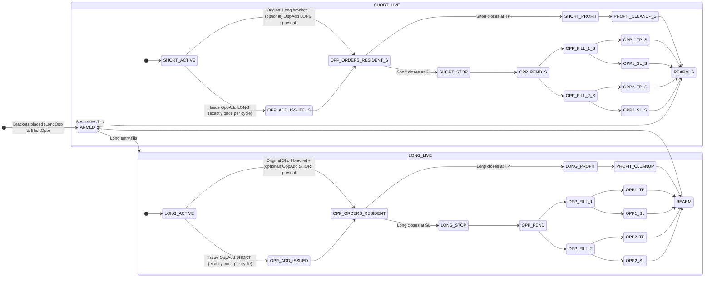
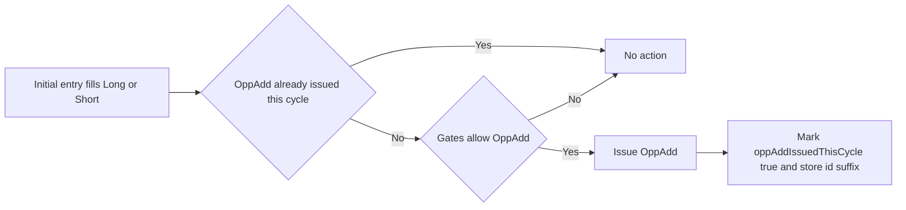
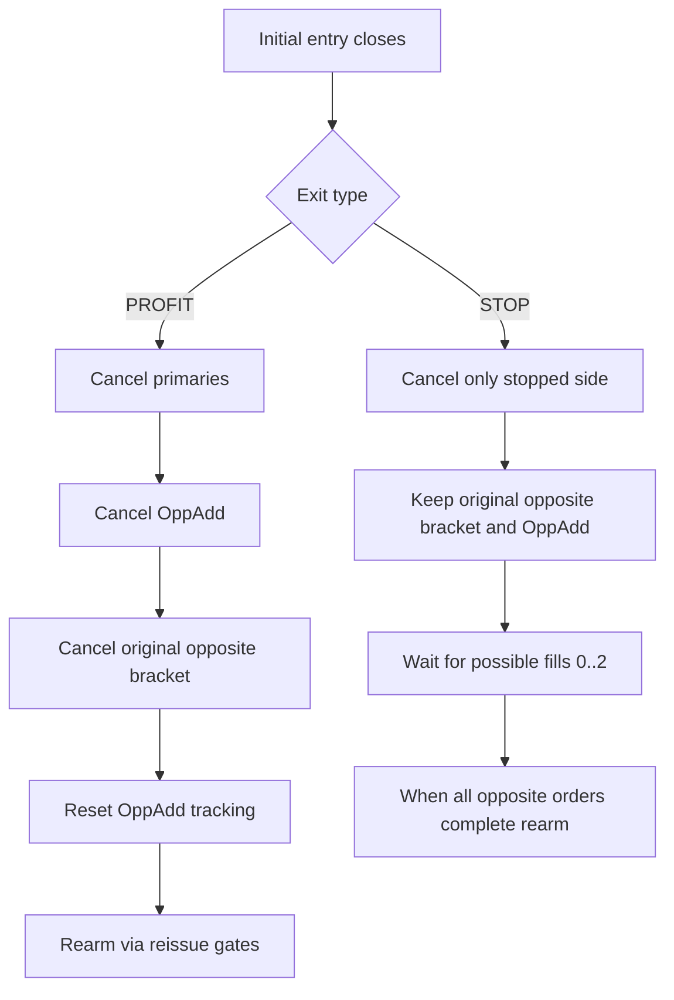
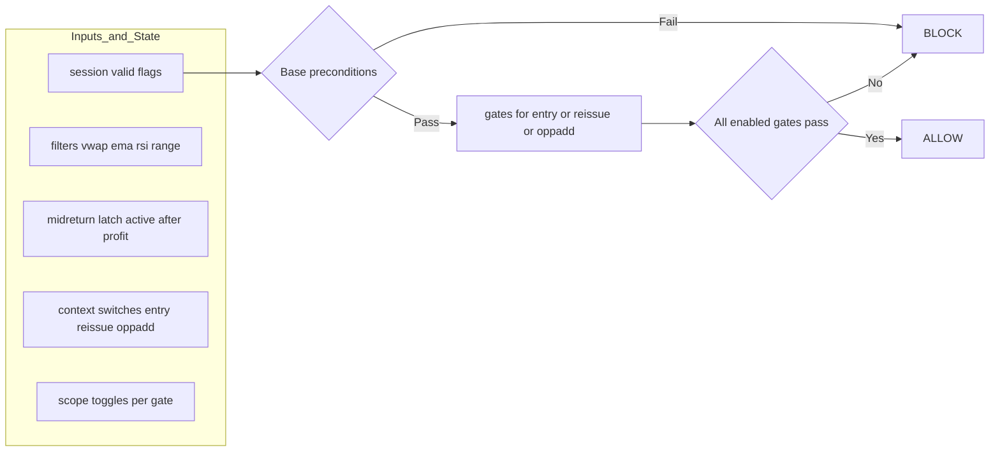

# Bracket Cycle & Opposite-Add — Spec & Stateflows (README)

This README documents the agreed behavior for bracket cycles, single-shot Opposite-Add issuance, and cleanup rules on **PROFIT** vs **STOP**, plus the **modular gate manager** and its per-context overrides. All diagrams are **Mermaid** and render on GitHub.

---

## TL;DR (Behavior Contract)

- **Initial bracket placement (ARMED):** Both Long and Short brackets are placed.
- **On initial fill (Long or Short):**
  - Keep the **original opposite bracket** in place.
  - Issue **exactly one** additional **Opposite-Add** order on the entry bar.
- **If the initial entry later exits at PROFIT:**
  - Cancel **both** opposing orders (original opposite bracket **and** the added OppAdd).
  - Reset OppAdd tracking and **rearm** fresh brackets (subject to gates).
- **If the initial entry later exits at STOP:**
  - **Do not cancel** the opposing orders; both (original opposite + OppAdd) remain in place and may fill.
  - No new OppAdd is issued again during this cycle (single-shot rule).
- **Gates:** One modular gate manager; scopes for Entry/Reissue/OppAdd. By default, **OppAdds ignore the MidReturn latch** (configurable), while Entry/Reissue typically use full gates.

---

## 1) High-level State Machine — One Bracket Cycle

**Notes**

- **OppAdd issuance** occurs **exactly once per bracket cycle** and only on the bar of the initial fill for that cycle.
- On **PROFIT** of the initial entry: cancel both opposing orders (the original opposite bracket and the added OppAdd), then rearm fresh brackets.
- On **STOP** of the initial entry: **keep** both opposing orders posted; they may fill subsequently. When all outstanding opposing orders finish (TP or SL), rearm fresh brackets.

---

## 2) OppAdd Issuance Logic (Single-Shot) — Decision Flow

**Gate context**

- `gates_for_oppadd` is the scoped gate set (e.g., Sev3/VWAP/Range/EMA/RSI), with **MidReturn gate typically disabled** for OppAdds unless explicitly enabled by config.

---

## 3) PROFIT vs STOP Cleanup — Decision Tree

---

## 4) Modular Gate Manager — Per-context Application

**Context rules**

- **Entry/Reissue**: typically apply full gate set, including **MidReturn** when armed (post-profit).
- **OppAdd**: uses `gates_for_oppadd()` — by default **MidReturn is disabled**, others are configurable per scope.

---

## 5) Identifier & Tracking Conventions (for cancel safety)

- **OppAdd IDs**: `OppAddL_<bar_index>` / `OppAddS_<bar_index>`; we store `<bar_index>` + direction so we can cancel both entry and exit legs deterministically when needed.
- **Cycle tracking**: `oppAddIssuedThisCycle` ensures only one OppAdd is issued until the cycle resets on PROFIT rearm or after all opposite orders complete post-STOP.
- **MidReturn latch (post-profit)**: `midReturnReq_active`, `midReturnSatisfied`, `midReturnArmedFromBar`.

---

## 6) Version & Changelog

- **v1.0** — First formalized stateflow for bracket cycle + OppAdd; single-shot OppAdd per cycle; PROFIT/STOP cleanup rules; modular gates with OppAdd scope overrides.

---

## 7) License

---

## Centralized Exit Transaction (Atomic Exit)

**Goal:** one bar-atomic path that performs targeted cancels → flatten → alerts/JSON → label, so exits can’t desync from UI or OppAdd rules.

---

### Invariants
- No `cancel_all()`; only targeted cancels by ID.
- Labels trail actions (never lead).
- One OppAdd per cycle. Profit of the **initial** entry clears the opposite inventory; Stop keeps it resident.
- The function is **pure plumbing**: it does not mutate predeclared globals; callers update state based on returned signals.

---

### Function Contract
f_exit_atomic(
reason, // "TP" | "SL" | "Early" | "EOS" | "Manual"
role, // "initial" | "opposite_primary" | "opposite_oppadd"
side, // "long" | "short"
price, ts, tz, // exit metadata
chartTkr, proxyTkr, // routing
ids, // struct of known order IDs (this+opposite, incl. OppAdd)
policy // what to cancel; label toggle
) -> (
didExit, didSendProxy,
requestOppAddReset, // caller should clear OppAdd tracking
requestRearm, // caller should rearm brackets
canceledOppPrimary, canceledOppAdd
)

**`ids` (suggested fields):**
- This side: `idEntry`, `idExit`.
- Opposite primary: `idOppPrimary`, `idOppPrimaryExit`.
- Opposite OppAdd: `idOppAddEntry`, `idOppAddExit`.

**`policy` (booleans the caller sets):**
- `cancelThisSideChildren` (yes when closing a live position).
- `cancelOppPrimary`, `cancelOppAdd` (per matrix below).
- `cancelEverything` (EOS full cleanup).
- `emitLabel` (UI trace switch).

---

### Ordering Guarantees (inside `f_exit_atomic`)
1. **Targeted cancels first**  
   Cancel only the IDs that policy requires and that are non-empty.
2. **Flatten position**  
   `strategy.close_all(comment=...)` with canonical comment strings (e.g., **"Early Positive Close Exit"**).
3. **Chart alert emit**  
   Route via existing `emitExit(...) → f_send_exit(...)`.
4. **Proxy JSON emit**  
   Only if `proxyTkr != chartTkr`; return `didSendProxy`.
5. **Label last**  
   Only if `didExit` and `policy.emitLabel`.

---

### Policy Matrix (spec → flags)

| Event (who/why)                         | cancelThisSideChildren | cancelOppPrimary | cancelOppAdd | requestOppAddReset | requestRearm |
|-----------------------------------------|:----------------------:|:----------------:|:------------:|:------------------:|:------------:|
| **Initial** position **TP**             | ✅ | ✅ | ✅ | ✅ | ✅ |
| **Initial** position **Early** (profit) | ✅ | ✅ | ✅ | ✅ | ✅ |
| **Initial** position **SL**             | ✅ | ❌ | ❌ | ❌ | ❌ *(defer)* |
| **Opposite primary** completes (TP/SL)  | ✅ | ❌ | ❌ | ❌ | if no opposite orders remain → ✅ |
| **Opposite OppAdd** completes (TP/SL)   | ✅ | ❌ | ❌ | ❌ | if no opposite orders remain → ✅ |
| **EOS / Flatten-All**                   | ✅ | ✅ | ✅ | ✅ | ✅ *(per session rules)* |

**Meaning:**
- **Initial PROFIT/Early:** clear opposite inventory (primary + OppAdd), reset OppAdd tracking, and rearm.
- **Initial STOP:** keep opposite inventory posted; rearm only after all remaining opposite orders complete.

---

### Caller Responsibilities (no global writes inside function)
After calling `f_exit_atomic(...)`, the caller must:
- Reset OppAdd tracking if `requestOppAddReset`.
- Rearm brackets if `requestRearm`.
- Maintain a small “opposite outstanding” counter (0..2). Each opposite completion decrements it; when it hits 0, set `requestRearm`.

---

### Canonical Comment Strings
Use stable strings for fills/telemetry:
- **"Early Positive Close Exit"** (early profit flatten)
- **"Take Profit Close Exit"**
- **"Stop Loss Close Exit"**
- **"End Of Session Close Exit"**
- **"Manual Close Exit"**

---

### Call-Site Recipes

**1) Early Positive Close Exit (initial long example)**  
- Inputs: `reason="Early"`, `role="initial"`, `side="long"`.  
- Policy: `cancelThisSideChildren=1`, `cancelOppPrimary=1`, `cancelOppAdd=1`, `requestOppAddReset=1`, `requestRearm=1`, `emitLabel=1`.

**2) Initial STOP (long)**  
- Inputs: `reason="SL"`, `role="initial"`, `side="long"`.  
- Policy: `cancelThisSideChildren=1`; all others `0`. Opposite primary + OppAdd remain active.

**3) Opposite completion (post-STOP)**  
- Inputs: `reason="TP"` or `"SL"`, `role="opposite_primary"` **or** `"opposite_oppadd"`, `side` set to that opposite.  
- Policy: `cancelThisSideChildren=1`; others `0`. After the call, if **no opposite orders remain** → set `requestRearm=1`.

**4) EOS / Flatten-All**  
- Inputs: `reason="EOS"`.  
- Policy: `cancelEverything=1`, `emitLabel` optional. Return values typically imply `requestOppAddReset=1`, `requestRearm=1` for next session.

---

### OppAdd Rules (nuances)
- **Single-shot per cycle**: issued exactly once on the bar the initial entry fills. On **initial PROFIT/Early**, central exit cancels both the opposite primary and the OppAdd, and signals `requestOppAddReset`.
- **After initial STOP**: both opposite orders stay posted and may fill; **do not** reissue OppAdd within the same cycle; rearm only after they finish.

---

### Edge Cases & Idempotency
- **Same-bar retriggers:** guard labels on `didExit`; duplicate cancels are harmless (ID checks).
- **Partial fills:** central exit always flattens the **position**; cancels target working children by ID.
- **Manual exits:** map to `"Manual"`; recommended to treat as PROFIT for cleanup (configurable).
- **Chart vs Proxy:** function emits both the chart alert and optional proxy JSON; caller clears proxy state using `didSendProxy`.

---

### Test Checklist
- Early Positive: label appears **after** exit calls; opposite inventory removed; OppAdd tracking reset; rearm scheduled.
- Initial STOP: opposite inventory persists; no rearm until both opposite legs complete.
- Opposite completions: decrement outstanding count; rearm when zero.
- EOS: all IDs canceled; position flattened; next session armed.
- Comments in fills match the canonical strings above.

MIT (or project default).

