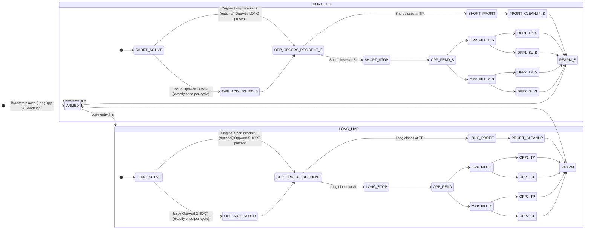
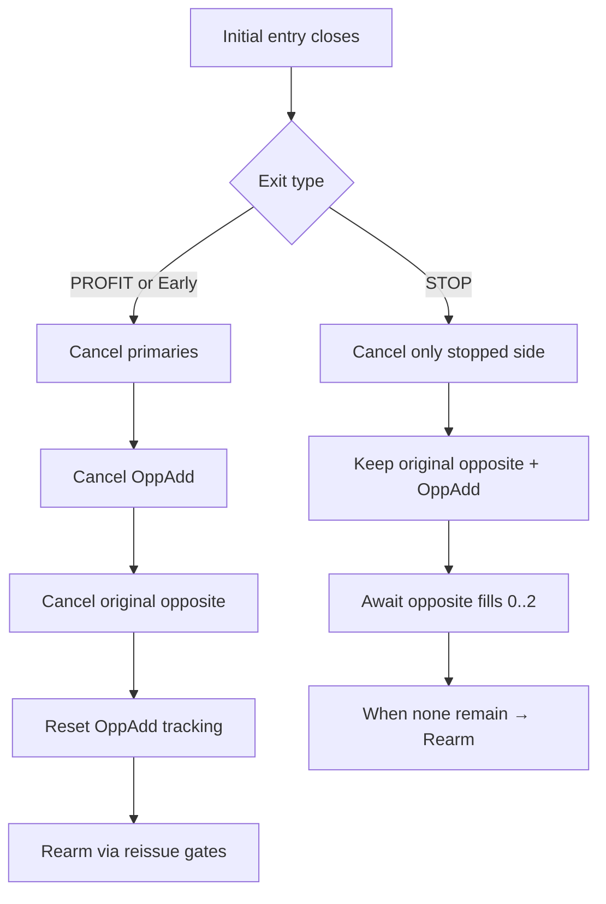

# Bracket Cycle & Opposite-Add — Spec & Stateflows (README)

**Version:** v1.1 (2025‑09‑29)  
**Scope:** Bracket cycles, Opposite‑Add rules, centralized exits, modular gate manager, **Daily Loss/Profit halts**, and **PnL consistency** across UI and gates.

---

## TL;DR (What changed since v1.0)

- **Daily Profit Cap added** alongside Daily Loss Cap; both gate new trading via `tradingHalted`.
- **PnL math unified & contract‑aware:** Dollars = `(exit − entry) × syminfo.pointvalue × |qty|`, **minus `strategy.closedtrades.commission`** per trade.
- **UI consistency:** Labels, data‑window, and Session Info Box all display **the same dayPL series** that halts use.
- **Session reset time:** day boundary is anchored at **15:00** in `tzInput` (DST‑safe), clearing daily halts.
- **Slippage & commissions** modeled via `strategy()` properties; closed‑trade prices & commissions reflect settings automatically.
- **Session Info Box placement:** panel is **lowered by one row** (extra spacer row) for small screens.
- **Re‑arm policy note:** Profit re‑arms currently use **live** levels (`long*/short*`) rather than frozen `use*`. If you keep properties static intra‑day, practical risk is minimal; otherwise consider switching to `use*` for session‑stable risk.

---

## 1) Daily Risk & Halt Policy

### Inputs & anchors
- **`maxDailyLoss`** (\$) — 0 disables.
- **`maxDailyProfit`** (\$) — 0 disables.
- **`tzInput`** — time‑zone string (e.g., `"America/Los_Angeles"`).
- **Day window**: `[dayStart, now]`, where `dayStart` = **15:00 local** on the current or prior calendar day (roll back 1 day if `time < dayStart`).

### PnL calculation (net dollars)
For each **closed** trade with `entry_time ∈ [dayStart, now]`:

```
priceDiff  = exit_price − entry_price   // signed for Long/Short
tradeDols  = priceDiff × syminfo.pointvalue × |size|
netDols    = tradeDols − closedtrades.commission(i)
```

**`dayPL`** = Σ `netDols` (sum across qualifying trades).  
Slippage (ticks) and commission settings in `strategy()` are respected automatically in closed‑trade prices & `commission(i)`.

### Halting rule
Set `tradingHalted := true` if **any** of the following are true:
- `maxDailyLoss > 0` **and** `dayPL ≤ −maxDailyLoss`.
- `maxDailyProfit > 0` **and** `dayPL ≥  maxDailyProfit`.
- Any existing global blocks (e.g., Sev3/news) are active.

**Reset:** On the first bar **≥ 15:00 local**, `tradingHalted := false` for the new day.

### Implications
- Halt gating flows through your existing **gate manager**; no need to touch entry call‑sites.
- Because `dayPL` is **net** and **contract‑aware**, halts now mirror broker totals more closely.

---

## 2) UI & Telemetry — Consistency & Placement

- **Labels & Data‑window:** Use the same formula as halts (contract‑aware, commission‑net) so displayed dollars match risk gates.
- **Session Info Box:** The table shows **Day PnL = `dayPL`**. The panel was lowered by **one row** using a blank spacer row to improve visibility on smaller screens.

**Display policy**
- **Gross vs Net:** Current policy is **Net** (subtract closed‑trade commission). If you prefer Gross visuals with Net halts (or vice‑versa), document the choice and keep it consistent.

---

## 3) Bracket Cycle — High‑level State Machine (unchanged semantics)



**Invariant recap**
- **Single OppAdd per cycle** on the bar of the initial fill.
- **Initial PROFIT/Early:** cancel opposite inventory (original opposite + OppAdd), reset OppAdd tracking, and **rearm**.
- **Initial STOP:** keep opposite inventory resident; **no new OppAdd**; rearm after resident opposite orders complete.

---

## 4) PROFIT vs STOP Cleanup — Decision Tree (unchanged)



---

## 5) Modular Gate Manager — with Daily Halts

```mermaid
graph LR
  subgraph Inputs_and_State
    A1[Session validity]
    A2[Filters: VWAP/EMA/RSI/Range]
    A3[MidReturn latch (post-profit)]
    A4[Context: Entry / Reissue / OppAdd]
    A5[Scope toggles per gate]
    A6[Day PnL (net) & Daily Halts]
  end

  A1 --> B{Base preconditions}
  A2 --> B
  A3 --> B
  A4 --> B
  A5 --> B
  A6 --> B

  B -->|Fail| Z[BLOCK]
  B -->|Pass| C[gates_for(context)]

  C --> D{All enabled pass AND not tradingHalted}
  D -->|No| Z
  D -->|Yes| E[ALLOW]
```

**Notes**
- `tradingHalted` incorporates **Daily Loss** and **Daily Profit** caps (and any global blocks). When true, no new placements occur.
- OppAdd scope typically **disables** MidReturn unless configured otherwise; Entry/Reissue apply full gates.

---

## 6) Re‑arm Level Policy — Live vs Frozen `use*`

**Current behavior:** Profit re‑arms call placement with **live** entries/stops/TPs (`longEntry/shortEntry/...`).  
**Effect:** If you adjust ratios, offsets, or SL mode during the session, a re‑arm can change **$risk** vs the original breakout.  
**Stable alternative:** Call with frozen `useLong*/useShort*` to lock risk for the day.

> **Recommendation:** If your policy is *no intraday parameter changes*, current live‑level re‑arm is fine. If you tune mid‑session, prefer frozen `use*` for auditability and risk consistency.

---

## 7) Commission & Slippage Modeling

- **Commission:** Configure in `strategy()` (e.g., cash per contract). Aggregation subtracts `closedtrades.commission(i)` per trade → **net dayPL**.
- **Slippage:** Configure `slippage = N` (ticks). Affects model fills automatically; aggregation uses those adjusted prices.
- **Broker alignment:** With accurate commission & slippage, dayPL and halts closely track the broker’s P&L (residual differences can remain due to exchange fees not modeled separately).

---

## 8) Identifier & Tracking Conventions

- **OppAdd IDs**: store direction and a per‑bar suffix for deterministic cancels (entry/exit legs).
- **Cycle tracking**: a single boolean/enum prevents multiple OppAdds per cycle and coordinates **rearm** conditions.
- **Centralized exit**: one atomic path guarantees order of operations → targeted cancels → flatten → alerts/JSON → label.

---

## 9) Test Checklist (updated)

- **Daily Halts:** trigger at configured loss/profit caps; reset at 15:00 local.
- **PnL Consistency:** UI label, data‑window, and Session Info Box Day PnL match halts (contract‑aware, commission‑net).
- **Profit Cleanup:** opposite inventory removed, OppAdd tracking reset, rearm scheduled.
- **Stop Path:** opposite inventory remains resident; rearm only after completion; no extra OppAdd.
- **OppAdd Single‑shot:** exactly one issuance per cycle, gated.
- **Re‑arm Policy:** if properties are adjusted mid‑session, verify whether live vs frozen levels align with intended risk.

---

## 10) Changelog

- **v1.1 (2025‑09‑29)**  
  - Added **Daily Profit Cap** and clarified daily reset (15:00 `tzInput`).  
  - Unified **contract‑aware, commission‑net** PnL across halts and UI.  
  - Documented **slippage/commission** modeling and broker alignment.  
  - Lowered **Session Info Box** by one spacer row.  
  - Added policy note on **re‑arm level selection** (live vs frozen).  

- **v1.0**  
  - First formalized stateflows for bracket cycle + OppAdd; centralized exit invariants; modular gates.

---

## License

MIT (or project default).

